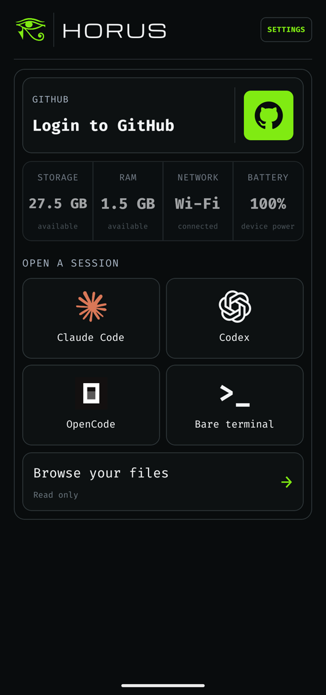
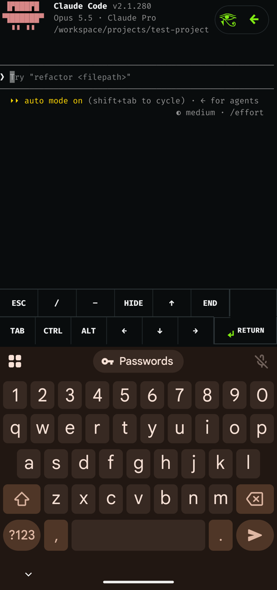
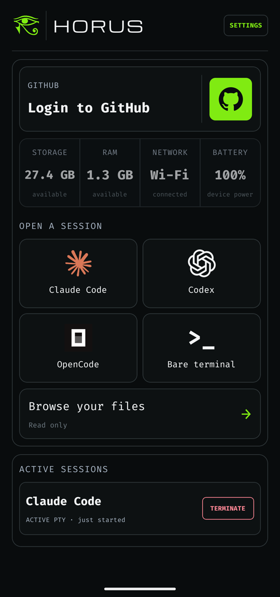
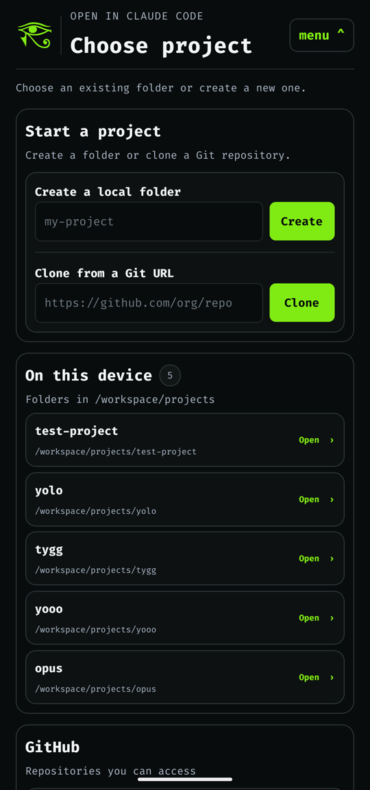
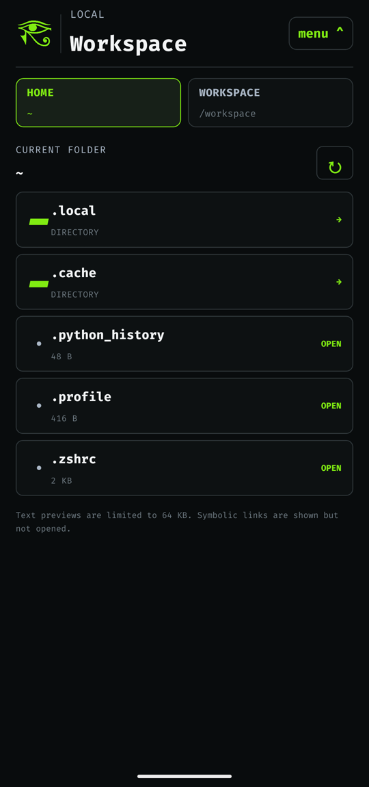
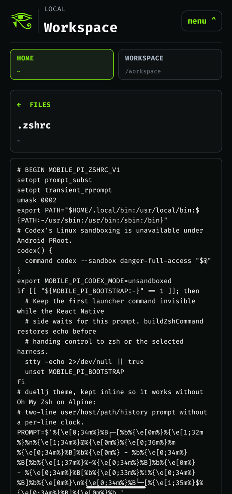
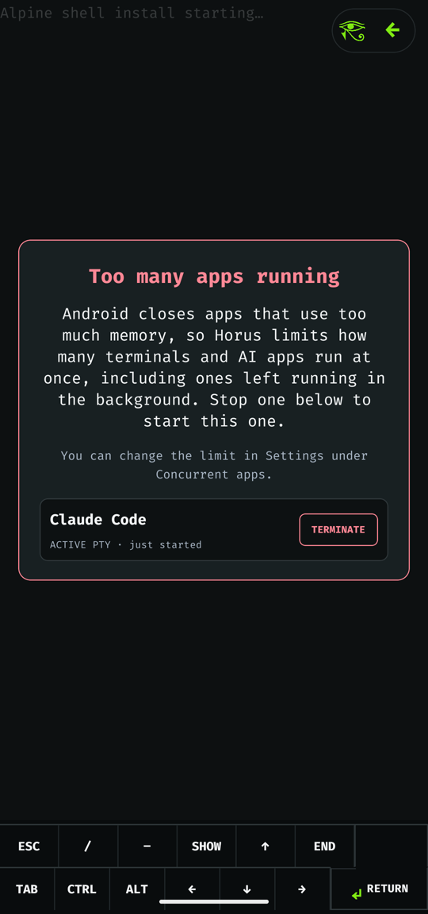
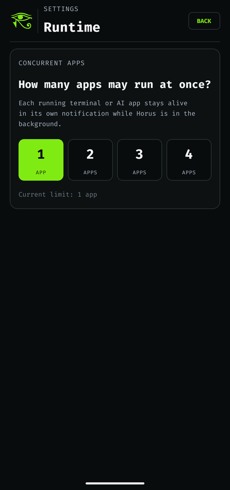

# Horus

Horus puts a real Alpine Linux ARM64 workspace on an Android phone and lets you
run coding agents — **Claude Code**, **Codex**, and **OpenCode** — or a plain
zsh shell inside it. No root and no Termux are required. The app ships its own
PRoot runtime, a native PTY, and a native terminal renderer.

<p align="center">
  
  
  
</p>

## Features

- **Alpine workspace on first launch.** Horus downloads a pinned Alpine
  minirootfs, checks its SHA-256 digest, and extracts it into app-private
  storage. Base tools such as `git`, `curl`, `jq`, `rg`, `python3`, and Node
  are provisioned on demand.
- **Coding agents in one tap.** Each harness is installed into its own home
  directory the first time you open it. Installer output stays visible in the
  terminal, and later launches reuse the install. Sign-in happens inside each
  CLI; Horus never handles provider credentials.
- **Projects.** You can create a local folder, clone any HTTPS/SSH Git URL, or
  pick one of your GitHub repositories. The GitHub CLI's device login opens in
  the Android browser. Projects live under `/workspace/projects`.
- **Real terminal.** The native PTY supports resize, Ctrl‑C, and job control.
  Output is rendered with an xterm.js engine. An extra key bar provides Esc,
  Tab, arrows, and sticky Ctrl/Alt.
- **Sessions survive the UI.** PTYs run in a foreground service in a separate
  `:terminal` process. They keep running when you switch apps, when the app
  locks, or when Android reclaims the UI. Each running session has its own
  notification.
- **Local lock.** Setting a password protects the app. Only a salted
  PBKDF2-HMAC-SHA256 verifier is stored. The workspace locks after 15 minutes
  in the background.
- **Read-only file browser** for your home directory and `/workspace`, with
  text previews.

## Screenshots

| Sign in | Launcher | Active sessions |
| :-: | :-: | :-: |
|  |  |  |

| Choose a project | Claude Code | Alpine shell |
| :-: | :-: | :-: |
|  |  |  |

| File browser | File preview | Session limit |
| :-: | :-: | :-: |
|  |  |  |

| Settings |
| :-: |
|  |

## Requirements

- An ARM64 (`arm64-v8a`) Android device. The minimum API level is 24; builds
  target API 36.
- Node.js ≥ 22.11, JDK 17, and the Android SDK/NDK. These are the standard
  [React Native environment](https://reactnative.dev/docs/set-up-your-environment)
  requirements.

## Build and run

```sh
npm ci
npm run build:android:debug      # or build:android:release
adb install -r android/app/build/outputs/apk/debug/app-debug.apk
```

Debug builds embed the JavaScript bundle, so they start without Metro. They
also skip the password screens and open straight into a development terminal.
Release builds enable the full onboarding and lock flow.

The release build type is signed with the debug keystore by default. Use your
own signing config before distributing an APK.

## Tests

```sh
npm run typecheck
npm run lint
npm run test:unit                # Jest (TypeScript / React Native)
npm run test:kotlin              # JVM unit tests for the native layer
npm run test:android:connected   # instrumented tests on a connected device
```

The `scripts/alpine-poc/` directory holds host and device acceptance scripts
(`npm run test:alpine-p*`, `npm run test:android:alpine-p*`). The device
scripts need `adb` and an installed release APK.

## How it works

```
React Native UI (App.tsx, src/)
  │  TerminalRuntime TurboModule + TerminalCanvas / TerminalInput native views
  ▼
Kotlin native layer (android/app/src/main/java/com/mobilepi/terminal)
  ├─ DistroStore*          rootfs download → verify → extract → promote
  ├─ ProotSessionLauncher  builds the PRoot command line and guest environment
  ├─ TerminalSessionService  foreground service in the :terminal process
  └─ NativeTerminalEngine / TerminalCanvasView  VT parsing and rendering
        │
        ▼
terminal_pty.c (JNI) ── PRoot (vendor/alpine-runtime) ── Alpine rootfs
```

- The PRoot binaries come from pinned Termux packages. You can reproduce them
  with `node scripts/alpine-poc/acquire-proot.mjs` and check them with
  `validate-proot-runtime.mjs`.
- Each harness runs as its own locked guest user (UIDs 61001–61003) with a
  private home. All harness users share workspace GID 1000, so they can work
  on the same projects.

### Security notes

- Android's app sandbox is the only real security boundary. PRoot emulates
  user IDs but gives no kernel isolation between harness users. Don't run
  harness code you don't trust.
- Codex's own Linux sandbox doesn't work under PRoot, so the shell wraps
  `codex` with `--sandbox danger-full-access`. Codex's approval prompts still
  apply.
- The diagnostic log records lifecycle metadata only, never terminal input or
  output.

## License

[MIT](LICENSE). Bundled third-party components (xterm.js, PRoot, talloc,
libandroid-shmem, fonts, harness marks) are listed in
[THIRD_PARTY_NOTICES.md](THIRD_PARTY_NOTICES.md).
